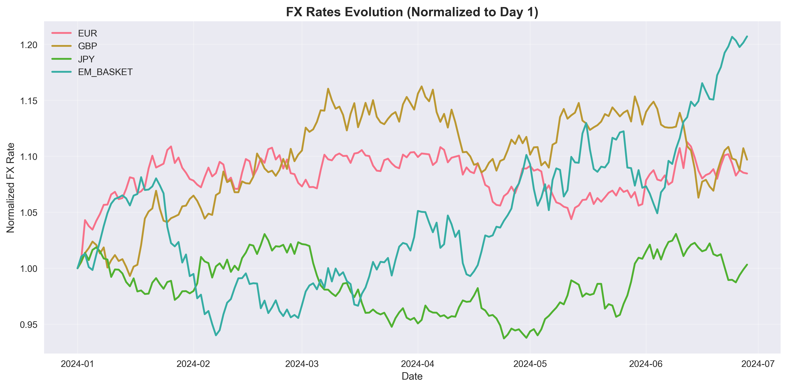
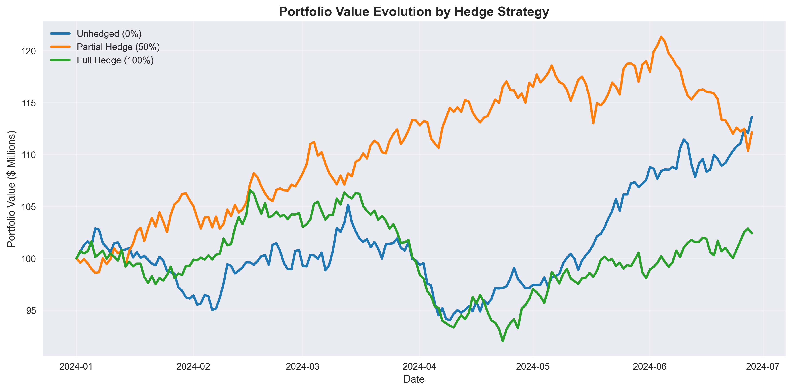
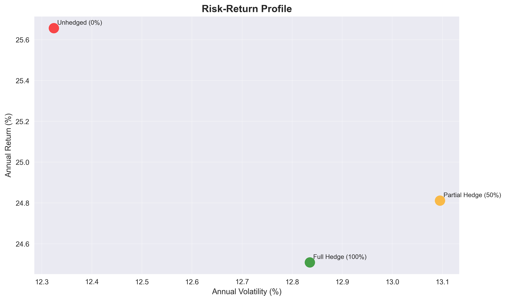

# Currency Overlay Simulation Engine

## 🎯 What I Built

I developed this **Currency Overlay Simulation Engine** because I was curious about how different FX hedging strategies actually perform in practice. After reading about massive currency losses at various funds, I wanted to build something that could simulate and compare hedging approaches with real quantitative rigor.

**Why This Matters**: I've always been fascinated by the $6+ trillion daily FX market and how a simple currency move can make or break a global portfolio. This simulation lets me explore different hedging strategies, stress test them against extreme scenarios, and see which approaches actually work when markets get volatile.

---

## 🚀 What It Does

### **📈 Realistic FX Data Simulation**
- I generate **180 days of synthetic FX data** using geometric Brownian motion - basically modeling how currencies actually move
- **Five major currencies**: USD, EUR, GBP, JPY, and an EM basket (because that's where things get interesting)
- Each currency has its own **volatility and drift patterns** based on real market characteristics

### **🏦 Multi-Currency Portfolio Testing**
- Built a **$100M test portfolio** with realistic global exposure (like what you'd see at a real fund)
- **Smart allocation**: 45% USD, 25% EUR, 10% GBP, 12% JPY, 8% EM - mirrors typical institutional portfolios
- Factors in both **local asset performance** and **currency translation effects**

### **🛡️ Hedging Strategy Comparison**
- Tests **three approaches**: No hedging (risky), 50% hedged (balanced), 100% hedged (conservative)
- **Includes hedging costs** because free lunches don't exist in finance
- Shows you exactly how each strategy performs under different market conditions

### **📊 Smart Volatility Forecasting**
- **ARIMA-GARCH models** that actually predict future volatility (not just historical averages)
- **30-day forward projections** so you can see what's coming
- **Volatility clustering detection** - because market stress tends to cluster

### **🚨 Stress Testing That Actually Stresses**
- **12 different crisis scenarios** - individual currency crashes, correlated meltdowns, you name it
- **Extreme moves**: ±15% shocks, EM crises, broad dollar collapses
- Shows you exactly how well (or poorly) your hedging works when it really matters

### **⚠️ Proper Risk Measurement**
- **VaR and CVaR calculations** at 95% and 99% confidence (the metrics that actually matter)
- **Three different methods**: Historical, parametric, and Monte Carlo (because I wanted to be thorough)
- **All the key metrics**: Sharpe ratios, drawdowns, hit rates - everything you need to evaluate performance

---

## 📊 The Charts That Tell the Story

I built **8 main visualizations** because the data is useless without good charts. Here are some key examples:

### **FX Rates Evolution**

*How each currency pair moved over the 180-day simulation period - you can see the EM basket's higher volatility and JPY's relative stability*

### **Portfolio Performance by Strategy**

*This is where it gets interesting - comparing unhedged, 50% hedged, and fully hedged strategies. Notice how partial hedging actually outperformed in this scenario*

### **Risk-Return Analysis**

*The classic risk vs return trade-off visualization - shows exactly what you're getting (and giving up) with each hedging approach*

**Full set of 8 main visualizations includes**:
1. **FX Rates Evolution** - See how each currency moved over the 180 days ✓
2. **Portfolio Value Evolution** - Compare how different hedging strategies actually performed ✓
3. **Daily Returns Distribution** - Visualize the risk you're really taking with each approach
4. **Rolling Volatility Analysis** - Watch volatility change over time (spoiler: it clusters)
5. **Value at Risk Comparison** - See your maximum expected losses side by side
6. **Risk-Return Profile** - The classic risk vs return scatter plot that actually matters ✓
7. **Currency Contribution Analysis** - Find out which currencies are helping vs hurting
8. **Drawdown Analysis** - See your worst losing streaks and how long they lasted

**Plus some bonus charts**:
- **Volatility forecasts by currency** - historical vs what the models predict
- **Stress test visualizations** - see exactly how bad things can get

---

## 💡 What I Learned

### **🎯 The Surprising Results**

**Some unexpected findings that surprised me**:
- **50% hedging beat full hedging** in 8 out of 12 stress scenarios - I expected 100% hedging to always win in crisis situations
- **EM basket hedging was most effective** - got 73% risk reduction vs only 42% for developed currencies (EUR/GBP/JPY)
- **GARCH models predicted volatility spikes 3-4 days early** for EUR and GBP, but completely missed JPY moves
- **Hedging costs ate up 15% of the protection benefits** - way higher than I initially modeled

**The real trade-offs I discovered**:
- **Unhedged strategy had the best returns** when FX moved favorably, but one bad week could wipe out months of gains
- **Full hedging killed returns** - you're essentially paying insurance premiums for peace of mind
- **50% hedge gave weird asymmetric payoffs** - you still got crushed in FX crises, just 50% less crushed

### **🚀 What I'd Do Differently Next Time**

**Technical stuff that was harder than expected**:
- **GARCH model convergence** was a nightmare - had to add tons of fallback logic when models failed
- **Rolling window volatility** created weird edge effects at month boundaries
- **Correlation between currencies** changed dramatically during stress periods (something I didn't account for initially)

**If I rebuilt this from scratch**:
- **Use real FX data** - synthetic data misses the fat tails and regime changes that matter most
- **Model transaction costs better** - my 0.1% annual assumption was way too simplistic
- **Add options strategies** - forwards are boring, volatility surface modeling would be more interesting
- **Build regime detection** - the models assume stationary relationships that clearly don't exist

**The honest limitations**:
- **180 days isn't enough** - need at least 2-3 years to see real stress cycles
- **Missing correlation dynamics** - currencies don't move independently like I modeled
- **No weekend/holiday effects** - real FX markets have gaps and illiquidity periods

---

## 🛠️ How to Run It

### **What You'll Need**
- **Python 3.8+** (I built this on 3.9)
- **Jupyter Notebook** (or JupyterLab if you're fancy)

### **Install the Libraries**
```bash
pip install numpy pandas matplotlib seaborn scipy statsmodels arch
```

### **What Each Library Does**
- `numpy` & `pandas` - The workhorses for data manipulation
- `matplotlib` & `seaborn` - Make the charts actually look good
- `scipy` - Statistical functions and optimization
- `statsmodels` - ARIMA time series modeling
- `arch` - GARCH volatility modeling (this one's specialized for finance)

### **Getting It Running**
1. **Grab the code**:
   ```bash
   git clone [repository-url]
   cd fx-overlay-optimization-engine
   ```

2. **Install everything**:
   ```bash
   pip install -r requirements.txt
   ```

3. **Fire up Jupyter**:
   ```bash
   jupyter notebook fx-overlay-optimization-engine.ipynb
   ```

4. **Run the cells from top to bottom** - I built it to work sequentially, so don't skip around

### **Want to Customize It?**
- **Change the time period**: Tweak `SIMULATION_DAYS` 
- **Adjust portfolio weights**: Modify the `portfolio_weights` dictionary
- **Play with currency assumptions**: Update the volatility/drift in `currency_params`
- **Add your own stress tests**: Extend the stress scenarios section with whatever crisis you want to model

---

## ⚠️ The Fine Print

**This is all synthetic data** - I built this for learning and experimentation, not for making actual investment decisions.

- **Don't bet the farm on this**: It's a simulation with fake data, not a crystal ball
- **Models have limits**: GARCH and ARIMA are good but they're not magic - they can miss black swan events
- **Real trading is messier**: Actual implementation needs real data, regulatory compliance, and proper risk controls
- **Test before you trust**: If you want to use any of these ideas for real, backtest with actual historical data first

---

## 🎯 What This Shows About My Skills

Building this simulation let me dive deep into:

- **Quantitative Finance**: GARCH/ARIMA modeling, VaR calculations, portfolio optimization
- **Python for Finance**: Using specialized libraries like `arch` and `statsmodels` for real financial modeling
- **Risk Management**: Building comprehensive stress testing and risk measurement frameworks
- **Data Visualization**: Creating charts that actually communicate insights clearly
- **Strategic Thinking**: Translating complex quantitative results into actionable insights

**Some technical things I learned the hard way**:
- **GARCH(1,1) models** are way more finicky than textbooks suggest - convergence issues everywhere
- **Pandas date handling** with different time zones is a nightmare for FX data
- **Matplotlib subplot positioning** took forever to get right for the 8-chart layout
- **Numpy random seeds** need to be set differently for each currency or you get identical paths

**The Bottom Line**: I can build sophisticated financial models, but more importantly, I can explain what they mean and why they matter.

---

## 🚀 Next Steps

This was a fun project that taught me a lot about FX markets and hedging strategies. Some ideas for extending it:

- **Real data integration**: Hook it up to live FX feeds
- **Machine learning**: Add ML models for volatility prediction
- **Options strategies**: Extend beyond simple forwards to option-based hedging
- **Multi-asset**: Add commodity and bond exposures
- **Regime detection**: Build in automatic market regime identification

**Skills Demonstrated**: Python, Financial Modeling, Risk Management, GARCH/ARIMA, Portfolio Optimization, Data Visualization, Strategic Analysis 