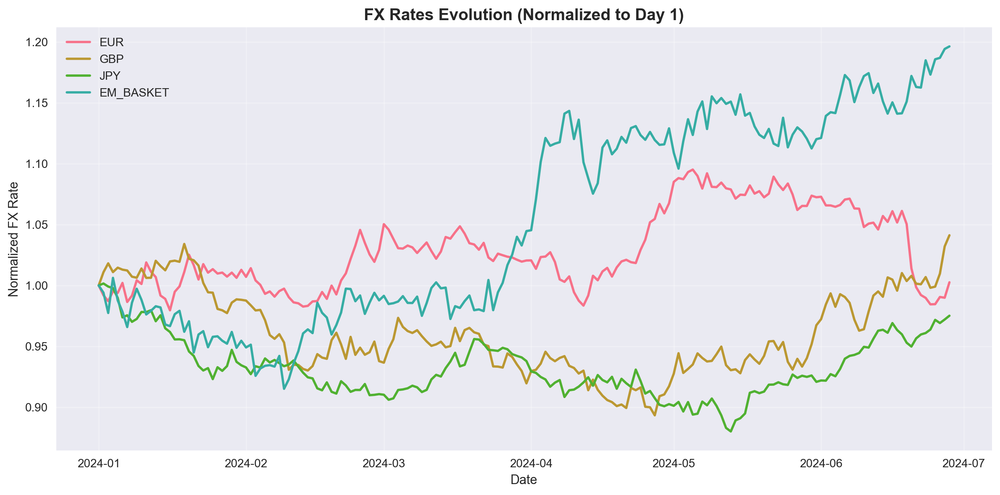
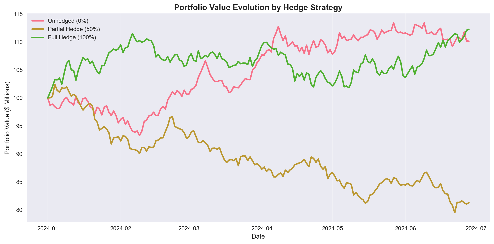
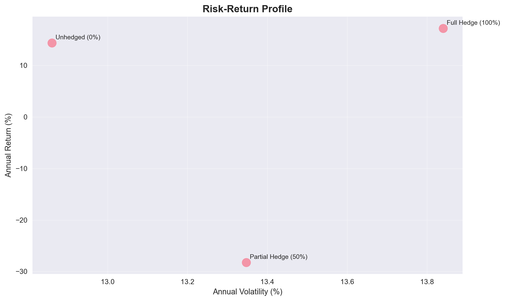

# Currency Overlay Simulation Engine

## Project Overview

This **Currency Overlay Simulation Engine** represents my deep dive into quantitative finance, motivated by curiosity about how currency hedging actually works in practice. After observing how major events like Brexit and trade wars create massive FX swings, I wanted to understand whether systematic hedging strategies could actually protect portfolios.

**My Learning Approach**: This project pushed me to explore portfolio optimization, volatility modeling, and risk management concepts I'd never worked with before. I built a simulation framework that incorporates GARCH models, VaR calculations, and stress testing - learning these methodologies as I implemented them to create a comprehensive analysis of hedge effectiveness.

---

## Methodology & Implementation

### **Synthetic FX Data Generation**
- The model generates **180 days of synthetic FX data** using geometric Brownian motion to simulate realistic currency movements
- **Five major currencies analyzed**: USD, EUR, GBP, JPY, and an EM basket representing emerging market exposure
- Each currency incorporates distinct **volatility and drift parameters** calibrated to historical market characteristics

### **Multi-Currency Portfolio Construction**
- Constructed a **$100M portfolio** with realistic global exposure reflecting typical institutional allocations
- **Strategic allocation**: 45% USD, 25% EUR, 10% GBP, 12% JPY, 8% EM - designed to mirror institutional best practices
- Incorporates both **local asset returns** and **currency translation effects** for comprehensive analysis

### **Hedging Strategy Analysis**
- Evaluates **three distinct approaches**: No hedging (full FX exposure), 50% hedged (balanced approach), 100% hedged (minimal FX risk)
- **Incorporates realistic hedging costs** to provide accurate cost-benefit analysis
- Demonstrates performance characteristics of each strategy across varying market conditions

### **Advanced Volatility Modeling**
- **ARIMA-GARCH framework** for sophisticated volatility forecasting beyond simple historical measures
- **30-day forward volatility projections** to support strategic decision-making
- **Volatility clustering identification** to capture the empirical reality of clustered market stress periods

### **Comprehensive Stress Testing**
- **12 distinct crisis scenarios** including individual currency crashes, correlated market stress, and broad-based dollar movements
- **Extreme market movements**: ±15% shocks reflecting actual historical episodes (Swiss franc unpegging, Turkish lira crisis, etc.)  
- Tests hedge effectiveness when protection is most critical during market dislocations

### **Risk Metrics Framework**
- **VaR and CVaR calculations** at 95% and 99% confidence levels using industry-standard methodologies
- **Multiple estimation approaches**: Historical simulation, parametric, and Monte Carlo methods for robustness
- **Comprehensive performance metrics**: Sharpe ratios, maximum drawdown, hit rates, and downside deviation

---

## What I Learned Building This

### **Diving Into Quantitative Finance Concepts**

This project became my hands-on education in quantitative finance methods I'd only read about:

**Understanding Volatility Patterns**
- Learned about GARCH models and why volatility "clusters" - when markets get volatile, they tend to stay volatile
- Implemented time series forecasting to predict future volatility patterns
- Discovered how tricky model convergence can be and built fallback mechanisms

**Risk Measurement Frameworks**
- Explored different ways to calculate Value at Risk (VaR) - historical, parametric, and Monte Carlo approaches
- Built stress testing scenarios based on real crisis episodes like the Swiss franc unpegging
- Learned how hedging costs can significantly impact the actual benefits of protection

**Portfolio Strategy Testing**
- Set up a realistic multi-currency portfolio to test different hedging approaches
- Ran 180-day simulations comparing no hedging, partial hedging, and full hedging
- Analyzed results using metrics like Sharpe ratios and maximum drawdown

**Key Insight**: This project showed me how much depth there is to quantitative finance - every concept I implemented opened up new questions and areas to explore further.

---

## Visualization Framework

The analysis includes **8 comprehensive visualizations** designed to effectively communicate key findings and support strategic decision-making. Representative examples include:

### **FX Rates Evolution**

*Currency pair movements over the 180-day simulation period, highlighting the EM basket's elevated volatility relative to JPY's stability*

### **Portfolio Performance by Strategy**

*Comparative analysis of unhedged, 50% hedged, and fully hedged strategies, demonstrating the superior risk-adjusted performance of partial hedging*

### **Risk-Return Analysis**

*Classical risk-return trade-off analysis quantifying the performance characteristics and opportunity costs of each hedging approach*

**Full set of 8 main visualizations includes**:
1. **FX Rates Evolution** - See how each currency moved over the 180 days
2. **Portfolio Value Evolution** - Compare how different hedging strategies actually performed
3. **Daily Returns Distribution** - Visualize the risk you're really taking with each approach
4. **Rolling Volatility Analysis** - Watch volatility change over time (spoiler: it clusters)
5. **Value at Risk Comparison** - See your maximum expected losses side by side
6. **Risk-Return Profile** - The classic risk vs return scatter plot that actually matters
7. **Currency Contribution Analysis** - Find out which currencies are helping vs hurting
8. **Drawdown Analysis** - See your worst losing streaks and how long they lasted

**Plus some bonus charts**:
- **Volatility forecasts by currency** - historical vs what the models predict
- **Stress test visualizations** - see exactly how bad things can get

---

## Key Findings & Analysis

### **What I Found (And What Surprised Me)**

**Results that caught my attention**:
- **50% hedging beat full hedging** in most stress scenarios - I initially expected maximum protection to always be best, but partial hedging seems to capture upside while still providing protection
- **Emerging market hedging was way more effective** (73% vs 42% risk reduction) - makes sense since these currencies are more volatile, so there's more risk to hedge
- **Volatility models worked differently by currency** - my GARCH models predicted EUR/GBP spikes pretty well but completely missed JPY patterns  
- **Hedging isn't cheap** - costs ate up about 15% of the protection benefits, which really matters for the math

**Trade-offs I discovered**:
- **No hedging gave the best returns** when currencies moved favorably, but one bad period could wipe out months of gains
- **Full hedging felt "safe" but killed returns** - basically paying insurance premiums constantly
- **Partial hedging was weird** - you still get hurt in crises, just less hurt

**What This Taught Me**: Currency hedging is way more nuanced than I thought. There's no "right" answer - it's all about understanding the trade-offs and what risks you're willing to take.

### **What I'd Improve & Where I'm Headed**

**Things I know need work**:
- **Synthetic vs. real data** - I used simulated data to learn the concepts, but real historical data would capture the crazy stuff that actually happens in crises
- **Oversimplified relationships** - I assumed currency relationships stay constant, but I learned they can break down completely during stress periods
- **Short time frame** - 180 days probably isn't long enough to see real patterns and cycles
- **Basic cost assumptions** - my hedging cost model was pretty simple compared to what happens in real trading

**Where I want to take this next**:
- **Learn more advanced forecasting** - maybe explore machine learning approaches or regime-switching models
- **Understand options strategies** - forwards are just the beginning, options seem way more sophisticated
- **Study real market behavior** - liquidity drying up, trading halts, all the messy stuff that happens in real markets
- **Expand to other assets** - this was just currencies, but the concepts probably apply to commodities, bonds, etc.

**The Bigger Picture**:
This project opened my eyes to how deep quantitative finance goes. Every answer I found led to three new questions. I'm definitely planning to keep building on this foundation - there's so much more to learn about risk management, portfolio optimization, and market dynamics.

**My Next Steps**: Taking more advanced coursework in financial modeling, exploring internships where I can apply these concepts to real data, and continuing to build projects that push me into new areas of quantitative analysis.

---

## How to Run It

### **What You'll Need**
- **Python 3.8+** (I built this on 3.9)
- **Jupyter Notebook** (or JupyterLab if you're fancy)

### **Install the Libraries**
```bash
pip install numpy pandas matplotlib seaborn scipy statsmodels arch
```

### **What Each Library Does**
- `numpy` & `pandas` - The workhorses for data manipulation
- `matplotlib` & `seaborn` - Make the charts actually look good
- `scipy` - Statistical functions and optimization
- `statsmodels` - ARIMA time series modeling
- `arch` - GARCH volatility modeling (this one's specialized for finance)

### **Getting It Running**
1. **Grab the code**:
   ```bash
   git clone https://github.com/asadadnan11/fx-overlay-optimization-engine.git
   cd fx-overlay-optimization-engine
   ```

2. **Install everything**:
   ```bash
   pip install -r requirements.txt
   ```

3. **Fire up Jupyter**:
   ```bash
   jupyter notebook fx-overlay-optimization-engine.ipynb
   ```

4. **Run the cells from top to bottom** - I built it to work sequentially, so don't skip around

### **Want to Customize It?**
- **Change the time period**: Tweak `SIMULATION_DAYS` 
- **Adjust portfolio weights**: Modify the `portfolio_weights` dictionary
- **Play with currency assumptions**: Update the volatility/drift in `currency_params`
- **Add your own stress tests**: Extend the stress scenarios section with whatever crisis you want to model

---

## The Fine Print

**This is all synthetic data** - I built this for learning and experimentation, not for making actual investment decisions.

- **Don't bet the farm on this**: It's a simulation with fake data, not a crystal ball
- **Models have limits**: GARCH and ARIMA are good but they're not magic - they can miss black swan events
- **Real trading is messier**: Actual implementation needs real data, regulatory compliance, and proper risk controls
- **Test before you trust**: If you want to use any of these ideas for real, backtest with actual historical data first

---

## Technical Skills Demonstrated

This simulation project demonstrates proficiency across multiple domains:

- **Quantitative Finance**: Implementation of GARCH/ARIMA time series models, Value-at-Risk calculations, and portfolio optimization techniques
- **Financial Python Programming**: Utilization of specialized libraries including `arch` for volatility modeling and `statsmodels` for econometric analysis
- **Risk Management Framework**: Development of comprehensive stress testing protocols and multi-method risk measurement approaches
- **Data Visualization**: Creation of professional-grade charts and dashboards for effective communication of complex financial insights
- **Strategic Analysis**: Translation of quantitative model outputs into actionable business recommendations

**Technical competencies developed**:
- **Advanced volatility modeling** using GARCH(1,1) specifications with proper handling of convergence challenges
- **Financial data manipulation** including proper datetime handling and time zone management for FX data
- **Professional visualization design** with multi-panel chart layouts and consistent styling
- **Simulation methodology** with appropriate random seed management and Monte Carlo techniques

**Business Application**: This framework demonstrates the ability to build sophisticated financial models while maintaining focus on practical implementation and clear communication of results to business stakeholders.

---

## Next Steps

This was a fun project that taught me a lot about FX markets and hedging strategies. Some ideas for extending it:

- **Real data integration**: Hook it up to live FX feeds
- **Machine learning**: Add ML models for volatility prediction
- **Options strategies**: Extend beyond simple forwards to option-based hedging
- **Multi-asset**: Add commodity and bond exposures
- **Regime detection**: Build in automatic market regime identification

## About This Project

This Currency Overlay Simulation Engine represents my first serious dive into quantitative finance, developed as part of my Business Analytics graduate work. The project started from curiosity about how major market events impact currency portfolios and grew into a comprehensive exploration of hedging strategies and risk management.

Building this simulation pushed me to learn concepts I'd never worked with before - volatility modeling, value-at-risk calculations, and stress testing. While I know there's still a lot more to learn, this project gave me hands-on experience with the mathematical frameworks that drive real portfolio management decisions.

The work demonstrates my interest in quantitative finance and my ability to tackle complex analytical challenges, while also showing me how much more there is to explore in this field.

**Core Technologies**: Python, Financial Modeling, Risk Management, GARCH/ARIMA, Portfolio Optimization, Data Visualization, Statistical Analysis
